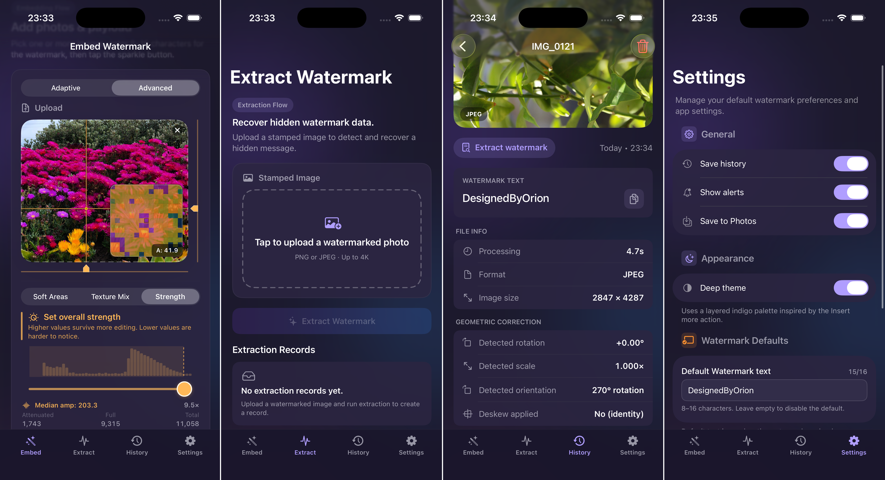
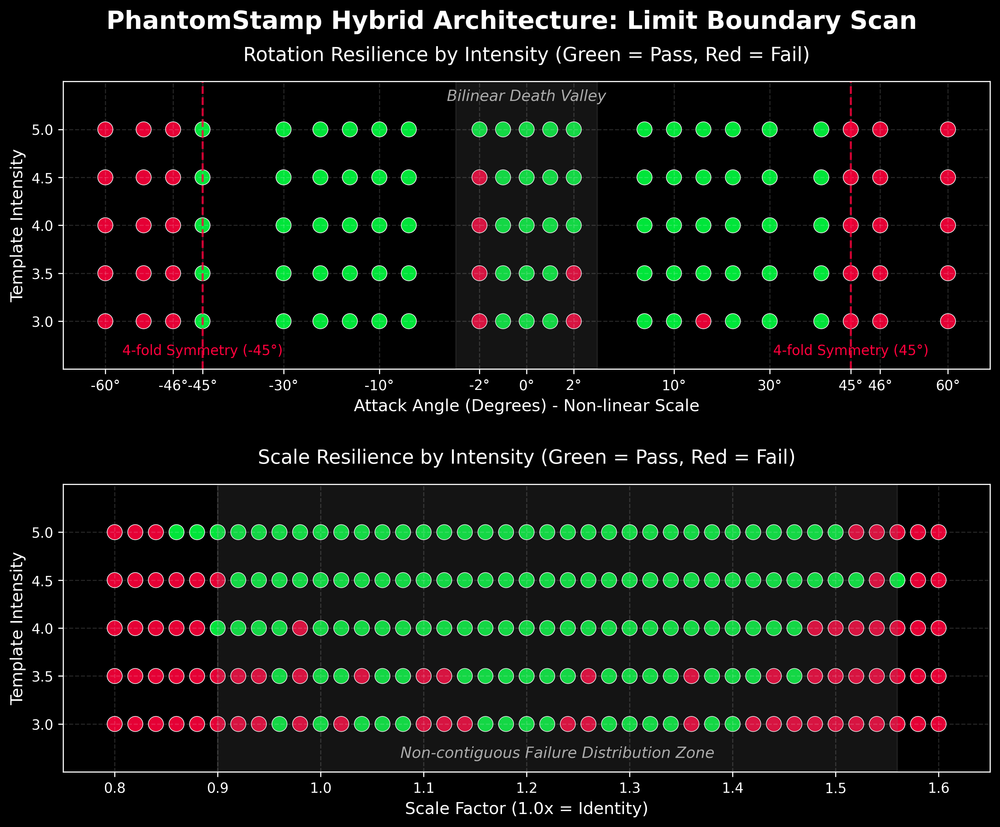
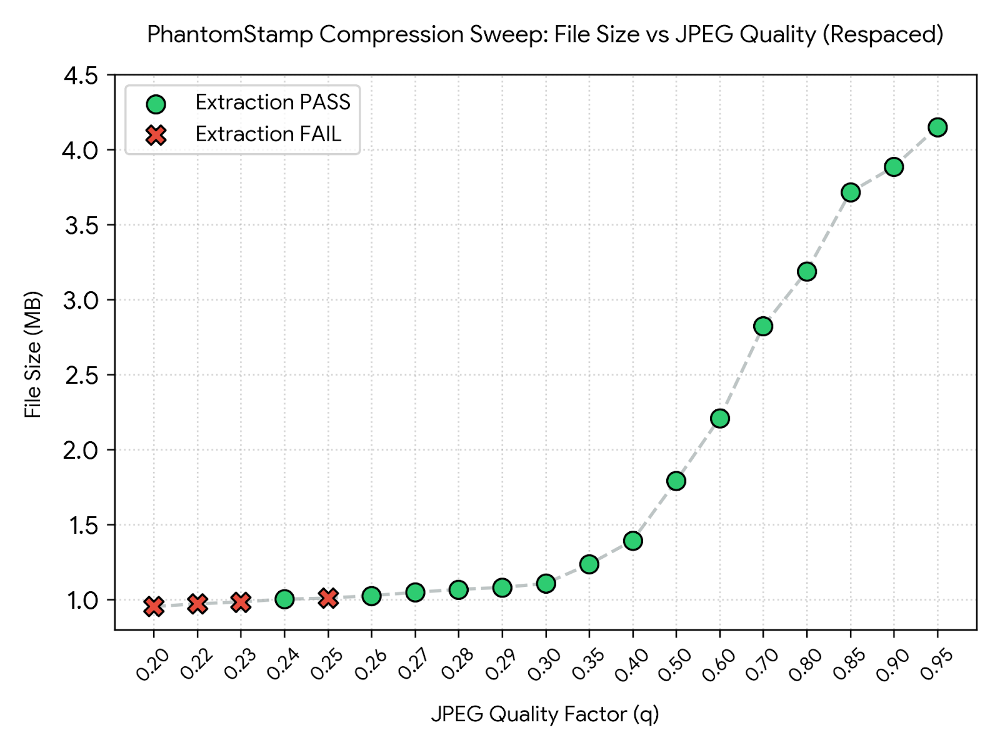
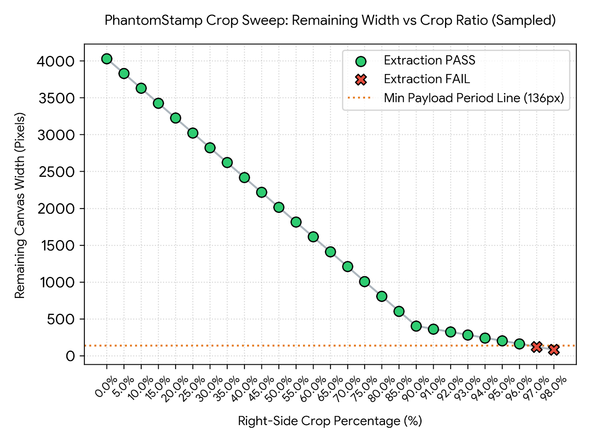
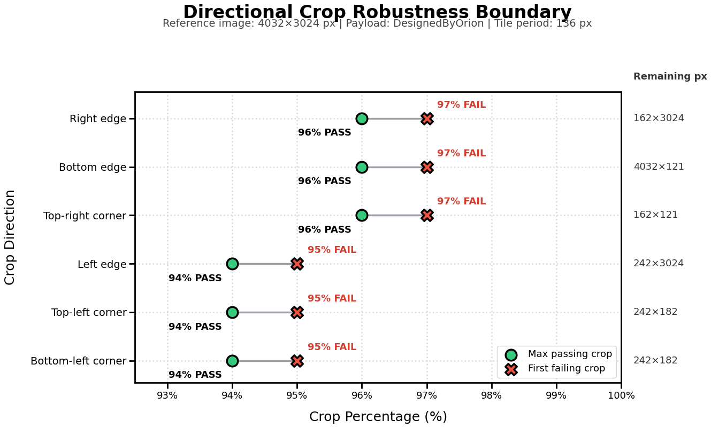

# PhantomStamp - iOS Frequency Domain Blind Watermark Tool

* **GitHub Repository:** [1zumiii/PhantomStamp](https://github.com/1zumiii/PhantomStamp)
* **Video Presentation (earlier version):** [Watch on Google Drive](https://drive.google.com/file/d/1rBPoBV3JAGi38SdUDUDxOj4K1WqetIcT/view?usp=sharing)
* **Prototype:** [Figma Interactive Demo](https://www.figma.com/proto/GKE5AVKHtmakByYIsy8D9o/PhantomStamp?node-id=0-1&t=nQGHNjCcTTFPQSyT-1)

## 1. Project Overview

  

**PhantomStamp** is an iOS application designed for digital artists, photographers, and content creators. It combines local Discrete Cosine Transform (DCT) payload embedding with FFT-based geometric synchronization so that a compact ownership identifier can be recovered without the original image. At the tested settings, the watermark is intended to remain visually unobtrusive while tolerating common operations such as compression, cropping, rotation, scaling, and localized edits.

PhantomStamp provides recoverable ownership evidence, not cryptographic authentication or standalone legal proof of authorship. The product UI accepts an **8–16 character ASCII identifier** made from letters, numbers, `.`, `_`, `-`, and `@`.

## 2. Problem Statement

During digital content distribution, creators face several core pain points:

* **Visual Interference:** Traditional visible watermarks (e.g., text, logos) obscure image details and degrade the artistic value of the work.
* **Vulnerability to Removal:** Visible watermarks can be easily cropped out, covered, or erased using modern AI removal tools (like Content-Aware Fill).
* **Difficulty in Copyright Assertion:** When creators discover stolen work, it is often difficult to prove ownership without presenting the original file for comparison.
* **Distribution Loss:** Metadata and weak watermark signals may be stripped or degraded by social-media recompression, resizing, screenshots, and repeated exports.

## 3. Technical Principles

PhantomStamp uses a dual-domain **hybrid architecture** that combines compact local data hiding with global geometric synchronization:

### 3.1 Discrete Cosine Transform (DCT) & Local Data Hiding

The app uses Apple's **Accelerate (vDSP)** framework to divide the host image's Y channel into 8x8 blocks and transform them into the frequency domain. The payload is embedded into the **(1,2) and (2,1) mid-low-frequency coefficients** by modifying their relative magnitude relationship.

To balance robustness and visual fidelity, an **Adaptive Quantization Step** is employed. The algorithm calculates the mean absolute AC magnitude of each 8×8 block to assess texture complexity dynamically. Smooth areas receive a lighter embedding to reduce visible distortion, while highly textured areas receive a stronger embedding to improve robustness against compression.

### 3.2 Global Geometric Synchronization (DFT & Inverse Mapping)

To counter rotation and scaling, which disrupt block-based DCT alignment, PhantomStamp adds a tiled, precomputed spatial synchronization template composed of cosine components.

* **Embedding:** The synchronization template is added directly to the luma plane without a convolution stage. Under suitable signal strength, it produces four detectable peaks at known relative locations in the magnitude spectrum.
* **Spectrum Estimation:** Before any DCT data retrieval, the algorithm analyzes multiple spatially separated 512x512 zero-mean windows, applies a **2D Separable Hann Window** to reduce rectangular-boundary leakage, and performs a **2D Fast Fourier Transform (FFT)**. Each window proposes a rotation and scale estimate; compatible proposals are clustered into consensus candidates, reducing the risk that a localized high-contrast edit forces a destructive full-frame correction. A lossless identity candidate is always retained for downstream validation.
* **Sub-pixel Parameter Recovery:** Within each analysis window, peak positions are refined with a Hann-matched **Grandke ratio interpolator**. This substantially reduces discrete-bin bias before candidate transforms are validated by the DCT synchronization and FEC pipeline.
* **Deskewing Pipeline:** Using a forward transformation matrix for inverse mapping combined with **Bilinear Interpolation**, the corrupted image is realigned. The intermediate values bypass any integer truncation and flow into a high-fidelity **FloatMatrix**, preserving sub-pixel phase fluctuations required for downstream DCT extraction.

### 3.3 Payload Reliability (FEC & Interleaving)

To reduce localized burst errors caused by image damage or compression artifacts, the payload is encoded before embedding:

* **Extended Hamming(8,4) Code:** Provides SECDED (Single Error Correction, Double Error Detection) capabilities.
* **Bit-level Codeword Interleaving:** Transposes encoded Hamming codewords so adjacent channel errors are distributed across multiple codewords after deinterleaving.
* **Variable-Length 2D Tile:** A length byte records the actual payload size. The text is not padded to 16 characters; after synchronization and FEC bits are assembled, only the trailing tile storage is zero-padded to the smallest enclosing square.

FEC improves reliability but does not authenticate the payload. It cannot prevent deliberate forgery and does not provide cryptographic integrity.

### 3.4 Blind Extraction & Sync-Gated Soft Voting

The extraction algorithm operates entirely blindly (requires no original image):

* **64-Offset Grid Search:** Tests all 8x8 pixel phases, then performs an in-memory sliding search for the 32-bit synchronization marker and the payload-dependent tile width.
* **Sync-Gated Local Evaluation:** Each repeated payload tile undergoes a "local health check" via its embedded 32-bit synchronization marker. Only repetitions maintaining the required local agreement are permitted to vote, blocking out-of-phase noise from edge-cropped or locally damaged zones.
* **Soft-Decision Energy Summation:** Instead of binary hard decisions, the system accumulates floating-point coefficient differences ($\Delta = |C_{(1,2)}| - |C_{(2,1)}|$) across certified repetitions. Stronger evidence therefore contributes more than marginal blocks.
* **Fail-Closed Candidate Validation:** A candidate must be backed by at least three independently sync-certified repetitions before an FEC decode may qualify as extraction success. Ungated fallback folds remain available for diagnostics, but cannot promote random noise into a valid payload. This distinction is necessary because Hamming SECDED provides error correction and detection, not cryptographic integrity.

## 4. Technical Highlights

* **Hann-Matched Grandke Alignment:** A 2D Hann window and Grandke ratio interpolation reduce the spectrum-estimation bias that otherwise accumulates into multi-pixel grid drift on 4K images. The precision figures reported below are measurements from the reference test asset, not universal error bounds.
* **FloatMatrix & Invalid-Region Masking:** Geometric correction writes interpolated samples into a floating-point plane instead of quantizing them back to `UInt8`. Out-of-bounds samples receive a `-1000.0` sentinel so any contaminated 8x8 block abstains from voting.
* **Orthogonal Ambiguity Resolution:** The four-peak synchronization template yields quarter-turn ambiguity. The downstream decoder evaluates eight score-grid topologies (four rotations, each with an optional mirror) and accepts only a topology that survives sync gating and FEC validation.
* **Spatial Consensus Against Local Damage:** Geometric estimation is distributed across center, corner, and adaptive edge windows. Rotation/scale proposals must agree in parameter space before receiving priority, while the identity path remains available throughout extraction. This prevents a small scribble or sharp artificial edge from turning a local channel defect into global grid destruction.
* **Bounded Concurrency and Memory Retention:** Embedding strips and several extraction searches run concurrently on available cores. `autoreleasepool` scopes reduce temporary-object retention, and completed extraction records retain bounded previews rather than full-resolution source images. These measures reduce peak and post-operation memory pressure but do not guarantee that the allocator immediately returns all pages to the operating system.
* **Binary Synchronization Asset:** The 512x512 template is generated offline and shipped as a 1 MiB raw `Float32` asset. It is loaded once into a cached float array, avoiding text or image-format parsing at runtime.
* **Event-Driven Progress State:** The SwiftUI progress overlay consumes notification events through an explicit state machine and continuation-based pacing rather than an idle polling loop.
* **Adaptive Backpressure via Min-Heap:** A custom **Min-Heap** buffers out-of-order progress events with `O(log n)` insertion. Dynamic pacing accelerates the overlay when a backlog develops while preserving readable progress during normal operation.

## 5. Performance & Limit Testing

PhantomStamp includes automated boundary sweeps for geometric attacks, JPEG recompression, cropping, and local damage. Unless stated otherwise, the figures below are **empirical results from the bundled 4032x3024 reference image and the recorded test configuration**. They characterize that test run; they are not guarantees for every image, payload, codec, export path, or compound attack.

  
   
  <em>Figure 1: Reference pass/fail samples across rotation, scale, and synchronization-template intensity.</em>

### 5.1 Geometric Resilience (Intensity = 4.0 - 5.0)

* **Static Precision:** In the controlled detector measurements used for the documented sweep, angle error reached approximately $\le 0.002^\circ$ and relative scale error approximately $\le 0.0003$. Natural-image interference and later resampling can produce larger end-to-end errors.
* **Rotation Resilience:** The geometric detector normalizes the fourfold spectrum ambiguity into a residual angle in the open interval $(-45^\circ, 45^\circ)$. The downstream topology search covers the associated quarter turns and mirror variants, providing full-circle hypothesis coverage without claiming that every image and angle must decode successfully.
* **Scaling Resilience:** At synchronization-template intensity 5.0 on the reference asset, the observed passing envelope was approximately **0.85x to 1.50x**. Results outside that range, and isolated failures inside it, depend on image content and resampling phase.

### 5.2 Resampling and Non-Monotonic Failure Regions

The boundary sweeps exposed two important DSP behaviors:

1. **Bilinear Resampling Loss:** Even a small non-identity transform moves most samples away from integer coordinates, so the corrective bilinear interpolation attenuates some high-frequency payload energy.
2. **Non-contiguous Failures:** Specific fractional scale factors can interact unfavorably with the resampling grid and image texture. A nearby, more severe factor may therefore pass when a milder factor fails.

Two separate controls affect this trade-off: **synchronization-template intensity** strengthens geometric peak detection, while **DCT embedding strength** increases the payload coefficient separation. Raising either value can improve robustness, but may also make image changes more visible. The current defaults are empirical operating points rather than a formal Human Visual System threshold.

### 5.3 Robustness Against Heavy JPEG Compression (Reference Configuration: Strength = 10.0, Threshold = -1.0)

To sample breakdown behavior under extreme lossy channel conditions, an automated 19-case non-uniform quality sweep was executed on a high-resolution **4032x3024** pixel asset. Under full-block embedding (`textureVarianceThreshold = -1.0`), the run demonstrates substantial resistance to aggressive quantization.

  
   
  <em>Figure 2: Non-uniform JPEG quality sweep showing file-size trends and non-monotonic extraction results.</em>

* **Lowest Passing Sample:** **q = 0.24** was the lowest tested quality that recovered the exact reference payload. It is not a continuous survival boundary: **q = 0.25 failed**, while **q = 0.24 passed**.
* **Observed File-Size Floor:** The encoded file size approached roughly 1 MiB below **q = 0.30** in this run. File size alone cannot identify which DC or AC coefficients caused that floor; codec metadata, residual image structure, and watermark energy may all contribute.
* **Quantization-Step Hypothesis:** The **q = 0.25 FAIL / q = 0.24 PASS** inversion is consistent with discrete quantization and rounding effects, but confirming the exact cause would require inspecting the codec's quantization tables and resulting coefficient errors.

### 5.4 Robustness Against Severe Edge and Corner Cropping

To evaluate grid-tracking resilience and redundant block spatial alignment under extreme surface destruction, segmented boundary sweeps were executed on a **4032x3024** image asset (`identity = PASS`). The primary reference chart below shows the right-edge sweep; follow-up all-direction sweeps were used to characterize edge and corner crops that preserve or remove the original tile-grid origin.

  
   
  <em>Figure 3: Segmented right-edge crop sweep with the 136px period for the reference payload shown as a reference line.</em>

  
   
  <em>Figure 4: Directional crop boundary summary for the reference image and payload.</em>

* **96% Best Directional Crop Pass:** The reference run recovered the exact payload after removing **96.0%** from right-edge, bottom-edge, and top-right corner crops. The next sampled point, **97.0%**, failed in these sweeps. The right-edge case leaves a **162x3024** slice; the bottom-edge case leaves a **4032x121** slice; the top-right corner case leaves a **162x121** patch.
* **94% Origin-Shift Crop Pass:** Directional sweeps that remove the left-side origin, including left-edge and bottom-left corner crops, recovered the reference payload through **94.0%** removal and failed at **95.0%**. This small drop is consistent with the extractor needing to rediscover the tile phase rather than inheriting the original grid alignment.
* **Payload-Dependent Spatial Period:** Tile width is not universally fixed at 136px. It depends on the payload length after the 32-bit sync marker, Hamming coding, interleaving, and square storage padding. The 15-character reference payload `"DesignedByOrion"` produces a $17 \times 17$ block tile, or a **136px** period; for comparison, the 10-character payload `"Successful"` produces a $15 \times 15$ tile, or **120px**.
* **Vertical Redundancy:** For `"DesignedByOrion"`, the uncropped 3024px axis contains 378 DCT-block rows, or roughly 22 complete 17-block tile heights before accounting for phase and partial repetitions. Sync gating determines how many of those repetitions are actually allowed to vote.
* **Identity Candidate:** A pure crop does not require rotation/scale correction. Because identity is always retained as a geometric candidate, the extraction pipeline can validate the unresampled luma plane and avoid unnecessary bilinear filtering.
* **Directional Interpretation:** The all-direction sweep shows a clear empirical split for this reference image: origin-preserving / top-right cases reached **96%**, while left-origin-shift cases reached **94%**. These are still measured limits, not universal guarantees; percentage limits are especially image-size-dependent because a 96% width crop and a 96% height crop leave different absolute pixel spans.

### 5.5 Local Damage and False-Positive Regression

Localized edits such as pen strokes, annotations, and high-contrast scribbles are evaluated separately from geometric attacks. This separation is important: an editor or export path that silently resizes the image introduces a compound scale attack and no longer measures local-damage resilience in isolation.

* **Same-Dimension Attack Generation:** The internal **Robustness Tests → Image tools** page can generate randomized short, high-contrast curves directly on a canvas matching the source pixel dimensions. Stroke count and width are configurable, and the output dimensions are verified again before the image is saved.
* **Geometric Isolation:** Because the generated image retains the exact source width and height, the tool removes accidental resizing as a confounding variable when evaluating local spatial corruption.
* **False-Positive Acceptance Rule:** A damaged image may either decode the correct payload or fail extraction. Returning an incorrect payload is treated as a regression. Sparse sync evidence and ungated fallback folding are therefore explicitly excluded from successful candidate validation.
* **Regression Coverage:** The DEBUG attack suite includes a full-resolution diagonal-scribble case and a compound downscale-plus-scribble guard case. The former checks recovery under pure local damage; the latter checks safe rejection rather than false success outside the documented reference scale envelope.

## 6. Current Limitations

* Product-facing payloads are restricted to **8–16 safe ASCII characters**. The watermark is intended for compact identifiers, not long-form metadata.
* Robustness depends on image content, dimensions, payload length, embedding settings, codec behavior, and the sequence of edits.
* The documented extrema come from controlled single-image sweeps. Compound attacks can fail even when each individual operation lies inside a separately measured range.
* Hamming SECDED and sync gating reduce accidental corruption and false acceptance, but they do not provide signatures, encryption, or adversarial tamper proofing.
* "Invisible" means visually unobtrusive at the tested settings; it is not a guarantee of zero measurable pixel difference.

## 7. Tech Stack

* **Language:** Swift (Swift 5 language mode, built with the Apple Swift 6.3 toolchain)
* **UI Framework:** SwiftUI
* **Image Processing:** Accelerate (vDSP / vImage), UIKit, Core Graphics
* **Data Persistence:** SwiftData
* **Concurrency:** Swift Concurrency (`async`/`await`, task groups) and bounded GCD parallelism
